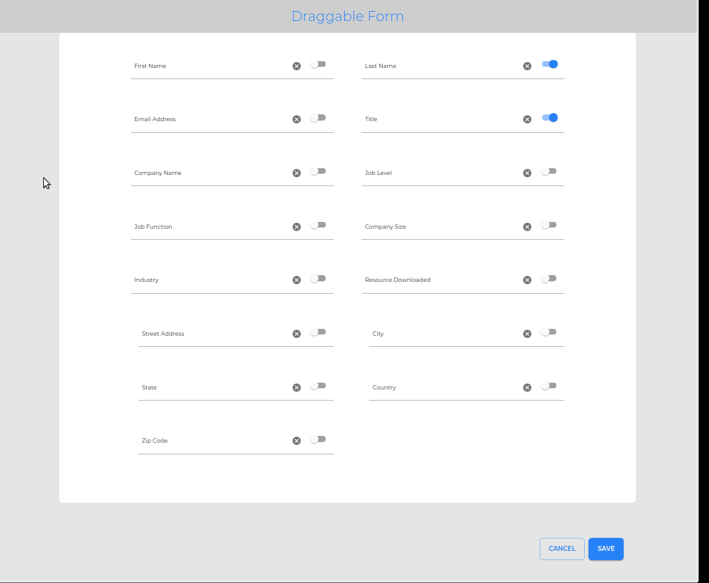

### Live Site Running here at [Nelify](https://musing-galileo-a29144.netlify.com/)

The fields here can be moved in any order. And then clicking on the Submit button that changed order will be posted to the backend API

The small toggle Switch in each of the Fields (shown in blue color) is used to mark whether the field is mandatory or not

#### To launch the project locally

`yarn install` and then

`yarn start`

